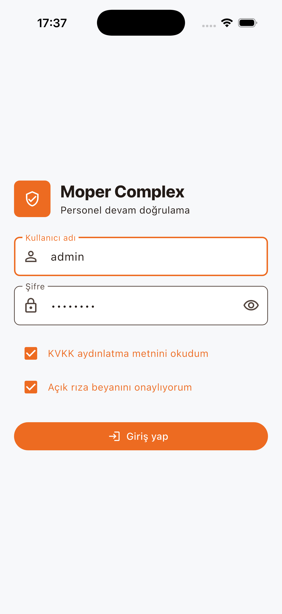
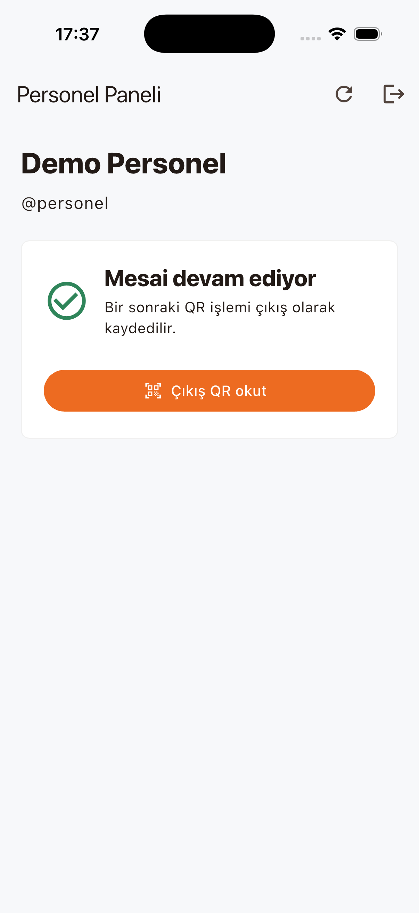
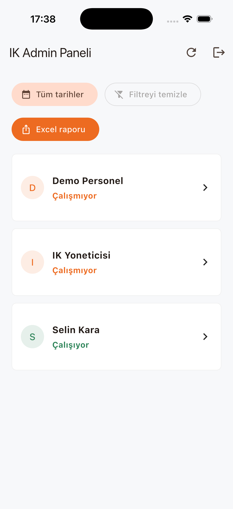
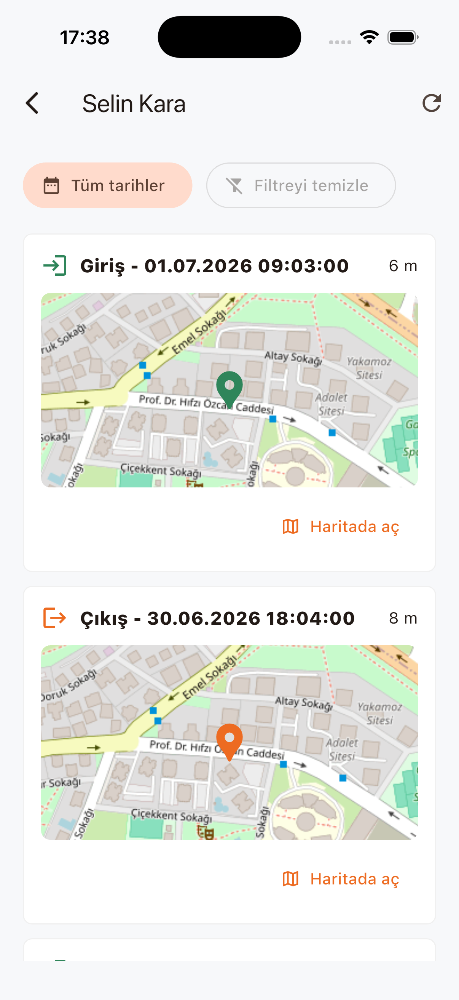

<div align="center">

# Moper Complex

**QR and location verified employee attendance tracking for small businesses**

Moper Complex is a Flutter-based attendance management app built for small and medium-sized businesses that need a practical, reliable, and low-cost way to monitor employee working hours.

Employees verify their check-in and check-out actions by scanning a workplace QR code and granting location access. HR/Admin users can track staff status, review attendance history, inspect map locations, and export reports from a single role-based application.

</div>

---

## Product Preview

<div align="center">

<table align="center">
  <tr>
    <td align="center" width="50%">
      <strong>Secure Login</strong>
    </td>
    <td align="center" width="50%">
      <strong>Employee Panel</strong>
    </td>
  </tr>
  <tr>
    <td align="center" valign="top" width="50%">
      <sub>Role-based access with legal consent checks</sub>
    </td>
    <td align="center" valign="top" width="50%">
      <sub>QR powered check-in and check-out flow</sub>
    </td>
  </tr>
  <tr>
    <td align="center" valign="top" width="50%">
      <br />
      <kbd></kbd>
    </td>
    <td align="center" valign="top" width="50%">
      <br />
      <kbd></kbd>
    </td>
  </tr>
  <tr>
    <td align="center" width="50%">
      <br />
      <strong>HR Dashboard</strong>
    </td>
    <td align="center" width="50%">
      <br />
      <strong>Map Details</strong>
    </td>
  </tr>
  <tr>
    <td align="center" valign="top" width="50%">
      <sub>Live staff status and attendance overview</sub>
    </td>
    <td align="center" valign="top" width="50%">
      <sub>Verified event locations with history</sub>
    </td>
  </tr>
  <tr>
    <td align="center" valign="top" width="50%">
      <br />
      <kbd></kbd>
    </td>
    <td align="center" valign="top" width="50%">
      <br />
      <kbd></kbd>
    </td>
  </tr>
</table>

</div>

---

## Overview

Moper Complex replaces paper sign-in sheets and manual working-hour checks with a verifiable digital workflow. It is designed for small teams, offices, shops, workshops, and field-oriented businesses that need a lightweight HR tool without enterprise-level complexity.

The core flow is simple:

1. The employee signs in to the mobile app.
2. The employee scans the QR code placed at the workplace.
3. The app requests location permission and sends the coordinates to the API.
4. The backend validates the QR token and geofence distance.
5. The system records a check-in or check-out event.
6. HR/Admin users review employee status, history, map details, and reports.

---

## Key Features

- QR code based check-in and check-out verification
- Location permission and workplace geofence validation
- Single Flutter app with employee and HR/Admin roles
- Real-time working / not working status tracking
- Attendance history with map-based event details
- Date range filtering for employee records
- Excel attendance report export
- JWT-based API authentication
- Clean MongoDB data model
- Embedded demo data for portfolio usage without starting the API
- Migration foundation for legacy `moper-person` and `moper-admin` data

---

## Tech Stack

<div align="center">


</div>

<div align="center">

<table align="center">
  <tr>
    <th align="center">Layer</th>
    <th align="center">Technologies</th>
  </tr>
  <tr>
    <td align="center">Mobile App</td>
    <td align="center">Flutter, Dart, Material 3</td>
  </tr>
  <tr>
    <td align="center">Backend API</td>
    <td align="center">Dart Shelf</td>
  </tr>
  <tr>
    <td align="center">Database</td>
    <td align="center">MongoDB</td>
  </tr>
  <tr>
    <td align="center">Authentication</td>
    <td align="center">JWT</td>
  </tr>
  <tr>
    <td align="center">Maps</td>
    <td align="center">OpenStreetMap tiles, <code>flutter_map</code></td>
  </tr>
  <tr>
    <td align="center">Reports</td>
    <td align="center">Excel export</td>
  </tr>
  <tr>
    <td align="center">Platforms</td>
    <td align="center">iOS, Android, web-ready Flutter structure</td>
  </tr>
  <tr>
    <td align="center">Tooling</td>
    <td align="center">Docker-ready API, Git, Flutter Analyze/Test</td>
  </tr>
</table>

</div>

---

## Project Structure

```text
moper-complex
|-- app   # Flutter app: auth, attendance, admin, legal, API client
|-- api   # Dart Shelf API: auth, attendance, admin, migration, repositories
`-- docs  # Architecture notes, migration notes, and screenshots
```

The Flutter app does not connect to MongoDB directly. All data access goes through the API layer. Mongo URI, JWT secret, QR token, and workplace coordinates are kept on the backend side through environment variables.

New contributors can start with the [Hi Developer Catalog](docs/hi-developer.md) for setup modes, API contracts, data models, migration notes, and development workflows.

---

## Demo Accounts

The portfolio demo can run without starting the backend service. If the API is not available, the Flutter app automatically falls back to embedded demo data.

| Role | Username | Password |
|---|---|---|
| HR/Admin | `admin` | `moper123` |
| Employee | `personel` | `moper123` |
| Employee | `selin` | `moper123` |

---

## Quick Start

### Flutter App

```bash
cd app
flutter pub get
flutter run
```

Run the app with the API enabled:

```bash
flutter run --dart-define=API_BASE_URL=http://localhost:8080
```

For Android Emulator:

```bash
flutter run --dart-define=API_BASE_URL=http://10.0.2.2:8080
```

### API

```bash
cd api
cp .env.example .env
dart pub get
dart run bin/server.dart
```

---

## Validation

```bash
cd api
dart analyze
dart test

cd ../app
flutter analyze
flutter test
```

---

## Portfolio Notes

This repository does not include real MongoDB credentials or production QR secrets. The Flutter portfolio demo works offline with embedded data. For API demo mode, `MOPER_USE_MEMORY=true` can be used. For production-like usage, provide Mongo URI and strong secret values through `.env`.

Technical documentation:

- [Hi Developer Catalog](docs/hi-developer.md)
- [Architecture](docs/architecture.md)
- [Migration](docs/migration.md)
